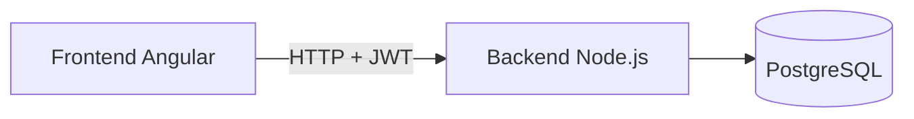
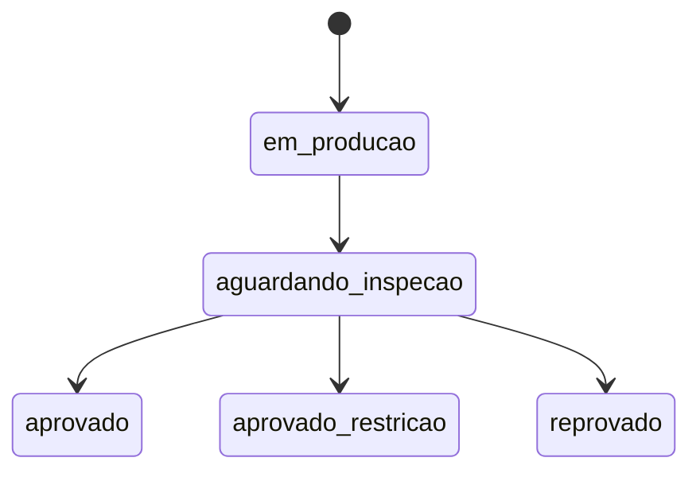

---

# 🚀 LotePath


Sistema web de **rastreabilidade de produção por lotes**, desenvolvido para o programa **INDT**, com foco em controle produtivo, inspeção de qualidade, rastreabilidade e suporte a cenários de **recall industrial**.

---

## 📌 Visão Geral

O **LotePath** digitaliza e centraliza o controle de produção, permitindo:

* 📦 Abertura automatizada de lotes
* 🔗 Vínculo de insumos por lote
* 🔍 Inspeção de qualidade com controle de desvios
* 🔁 Rastreabilidade direta e reversa
* 📊 Dashboard com indicadores operacionais

> 🎯 Objetivo: reduzir o tempo de análise em auditorias e recalls, aumentando a confiabilidade e visibilidade do processo produtivo.

---

## ❗ Problema Resolvido

Ambientes industriais frequentemente sofrem com:

* Controle manual (planilhas/papel)
* Baixa rastreabilidade
* Alto tempo de resposta em recalls
* Risco operacional elevado

O LotePath resolve isso com uma **arquitetura web integrada (backend + frontend)** e modelo de dados orientado à rastreabilidade.

---

## 🏗️ Arquitetura



### 🔧 Backend

* Node.js + Express
* TypeScript
* TypeORM
* PostgreSQL
* JWT (autenticação)
* Zod (validação)

### 🎨 Frontend

* Angular 21
* TypeScript

---

## 📁 Estrutura do Projeto

```bash
LotePath/
├── backend/
├── frontend/
├── src/
│   ├── controllers/
│   ├── database/
│   ├── dtos/
│   ├── entities/
│   ├── middlewares/
│   ├── routes/
│   ├── services/
│   └── server.ts
├── package.json
└── .env.example
```

---

## ⚙️ Como Executar

### 🔹 Backend

```bash
npm install
cp .env.example .env
```

Configure o `.env`:

```env
DB_HOST=localhost
DB_PORT=5432
DB_USER=postgres
DB_PASS=sua_senha
DB_NAME=indt_lotepath
PORT=5336
JWT_SECRET=sua_chave_jwt
```

```bash
npm run seed
npm run dev
```

📍 Backend: [http://localhost:5336](http://localhost:5336)

---

### 🔹 Frontend

```bash
cd frontend
npm install
ng serve
```

📍 Frontend: [http://localhost:4200](http://localhost:4200)

---

## 🔐 Credenciais de Teste

| Perfil   | Email                                                 | Senha  |
| -------- | ----------------------------------------------------- | ------ |
| Operador | [operador@lotepath.com](mailto:operador@lotepath.com) | 123456 |
| Inspetor | [inspetor@lotepath.com](mailto:inspetor@lotepath.com) | 123456 |

---

# 🔌 API — Rotas Principais

> 🔐 Todas as rotas (exceto login) exigem **JWT no header**:
> `Authorization: Bearer <token>`

---

## 🔑 Autenticação

| Método | Rota          | Descrição                   |
| ------ | ------------- | --------------------------- |
| POST   | `/auth/login` | Realiza login e retorna JWT |

**Exemplo:**

```json
POST /auth/login
{
  "email": "operador@lotepath.com",
  "senha": "123456"
}
```

---

## 📦 Produtos

| Método | Rota            | Descrição             |
| ------ | --------------- | --------------------- |
| GET    | `/produtos`     | Lista produtos ativos |
| GET    | `/produtos/:id` | Detalhe de produto    |
| POST   | `/produtos`     | Cria produto          |
| PUT    | `/produtos/:id` | Atualiza produto      |
| DELETE | `/produtos/:id` | Desativa produto      |

---

## 🏭 Lotes

| Método | Rota                | Descrição         |
| ------ | ------------------- | ----------------- |
| GET    | `/lotes`            | Lista com filtros |
| GET    | `/lotes/:id`        | Detalhe do lote   |
| POST   | `/lotes`            | Cria lote         |
| PATCH  | `/lotes/:id/status` | Atualiza status   |

**Filtros disponíveis:**

```
/lotes?produto_id=&status=&data_inicio=&data_fim=
```

---

## 🧪 Insumos (por lote)

| Método | Rota                           | Descrição               |
| ------ | ------------------------------ | ----------------------- |
| POST   | `/lotes/:id/insumos`           | Adiciona insumo ao lote |
| DELETE | `/lotes/:id/insumos/:insumoId` | Remove insumo           |

---

## 🔍 Inspeção

| Método | Rota                  | Descrição         |
| ------ | --------------------- | ----------------- |
| POST   | `/lotes/:id/inspecao` | Registra inspeção |

---

## 🔄 Rastreabilidade

| Método | Rota                                | Descrição      |
| ------ | ----------------------------------- | -------------- |
| GET    | `/rastreabilidade/lote/:id`         | Lote → insumos |
| GET    | `/rastreabilidade/insumo?valor=...` | Insumo → lotes |

---

## 📊 Dashboard

| Método | Rota         | Descrição                |
| ------ | ------------ | ------------------------ |
| GET    | `/dashboard` | Indicadores operacionais |

**Retorna:**

* lotesProduzidosHoje
* unidadesProduzidasHoje
* taxaAprovacaoMes
* lotesAguardandoInspecao
* ultimosLotes

---

## 🔗 Principais Funcionalidades

### 📦 Lotes

* Criação automática (`LOT-YYYY-NNNNN`)
* Controle de status
* Registro de produção

### 🧪 Inspeção

* Validação obrigatória de desvios
* Atualização automática de status

### 🔄 Rastreabilidade

* Por lote → insumos utilizados
* Por insumo → lotes afetados

### 📊 Dashboard

* Produção diária
* Taxa de aprovação
* Lotes pendentes
* Últimos registros

---

## 🔄 Ciclo de Vida do Lote



---

## 🧱 Modelo de Dados (Resumo)

### Produto

* Código único
* Nome, linha, status

### Lote

* Número automático
* Produto, operador
* Quantidade produzida
* Status e timestamps

### Insumo

* Nome, código, lote do fornecedor
* Quantidade e unidade

### Inspeção

* Resultado (aprovado/reprovado)
* Descrição de desvio (obrigatória)

---

## 📌 Requisitos Atendidos

### ✔ Funcionais

* Autenticação JWT
* Rastreabilidade completa
* Dashboard operacional
* Controle de status de lote

### ✔ Não Funcionais

* Senhas com bcrypt
* Variáveis sensíveis em `.env`
* API protegida
* Responsividade

---

## 📊 Status do Projeto

🟡 Em desenvolvimento

* Backend: funcional
* Frontend: em evolução

---

## 👨‍💻 Autores

* Paulo Rezende
* Kariton Gomes
* André Filipe

---

## 🔗 Repositório

👉 [https://github.com/pvrezende/LotePath](https://github.com/pvrezende/LotePath)

---

## 📄 Licença

Este projeto está sob a licença MIT.
